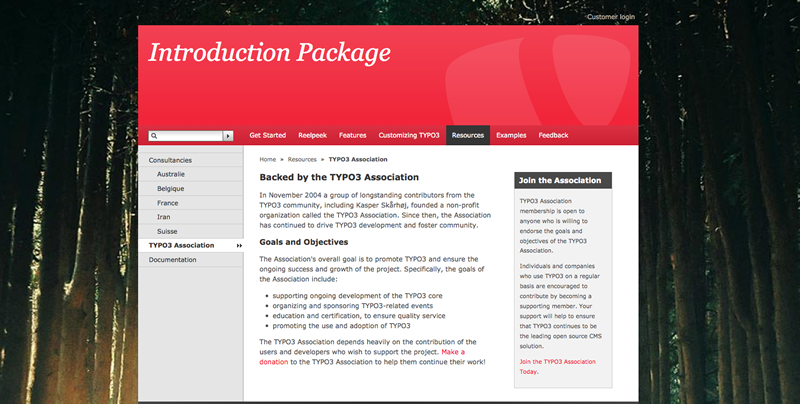
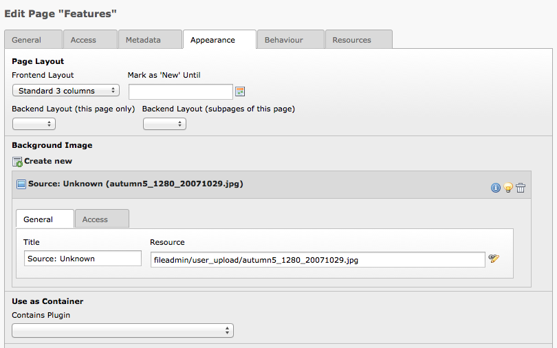

====================================
EXT: Supersized Background for TYPO3
====================================

:Extension Key: supersized
:Language: en
:Keywords: design, background image, fullscreen
:Dependency: PHP 5.3, TYPO3 4.5, Fluid 1.3, Extbase 1.3
:Copyright: 2011, Dominique Feyer, <dominique.feyer@reelpeek.net>

This document is published under the Open Content License available from http://www.opencontent.org/opl.shtml

The content of this document is related to TYPO3_ - a GNU/GPL CMS/Framework available from www.typo3.org

------------
Introduction
------------

What does it do?
================

This extension, based on Extbase and Fluid, offer a simple way to use full screen background in TYPO3 in a cross browser way. This extension is based on the jQuery plugin Supersized_.

------------
User Manuel
------------

Installation
============

This extension depend on a PHP 5.3, Extbase and Fluid. To use the extension just install the extension from the extension manager and include the TypoScript template "Supersized Configuration (supersized)".

--------------
Administration
--------------

By default the field to setup background image in the page properties is an exclude field. If you wont to allow some non admin user to setup the page background, just create a backend group to add access to this field.

-------------
Configuration
-------------

All the configuration are editable with the constant editor.

If you don't use jQuery in your website
=======================================

By default the extension don't include jQuery in your page. If you use jQuery in your website it's perfect, but if not you must change the constant "plugin.tx_supersized.settings.include.jquery". This extension come with a minified version of jQuery 1.6, so if you set the constant to "1" the local version of jQuery will be included in your page. You can set this value to "2" if you wont to use the same jQuery libs from Google CDN.

The background of your site will be reseted
===========================================

By default the extension include a new CSS in your page to reset the background of your website.

In many case this extension work nicely, but if you won't to customize the CSS, you can change the constant "plugin.tx_supersized.settings.css.supersized" to load you proper CSS file. To avoid loading of the CSS, just set the constant value to and empty string.

Configure your default background
=================================

You can edit the following constants to set the default background of your website:

- plugin.tx_supersized.settings.default.title
- plugin.tx_supersized.settings.default.resource

The resource can be a relative path to the current TYPO3 installation or a remote resource on an external HTTP server. External resource must be prefixed by http:// or https://.

You can even use this constant to set different default background per page tree branch. But you can also use a more easy way to manage your background.

Setting a custom background in any page
=======================================

Just edit the page properties of your page. Under the "Apparence" tab, you can create a new background image. A background image if defined by two properties:

- Title
- Resource

The resource can be a relative path to the current TYPO3 installation or a remote resource on an external HTTP server. External resource must be prefixed by http:// or https://.

The children of the current page will use the background image of their parents in to rootline. The extension take care to not deliver too big image (only for local image), you can configure the maximum width and height in the constant editor.

Random Background image
-----------------------

If you setup multiple background image for a page, the background image will be randomized.

--------------
Known problems
--------------

Currently none, if you have an trouble, please open a ticket at github or send me an email.

----------
To-Do list
----------

1. Support for multiple background image per page, with a navigation to change the background image
2. Add a way to add custom dynamic background image over an other plugin (commerce, tt_news, ...)
3. Found a way to server low resolution image for mobile browser

If you have any suggestion, please contact me or open a ticket, comment and patch are always welcome.

.. _TYPO3: http://www.typo3.org/
.. _Supersized: http://www.buildinternet.com/project/supersized/

